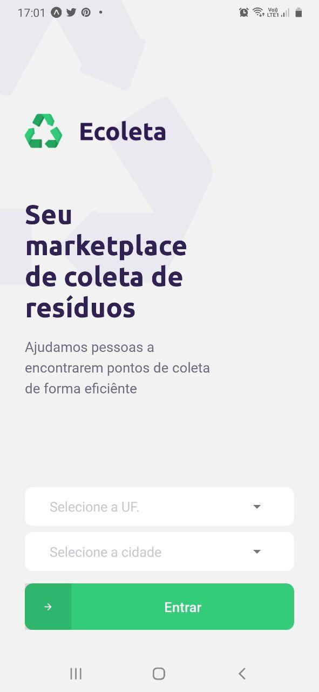
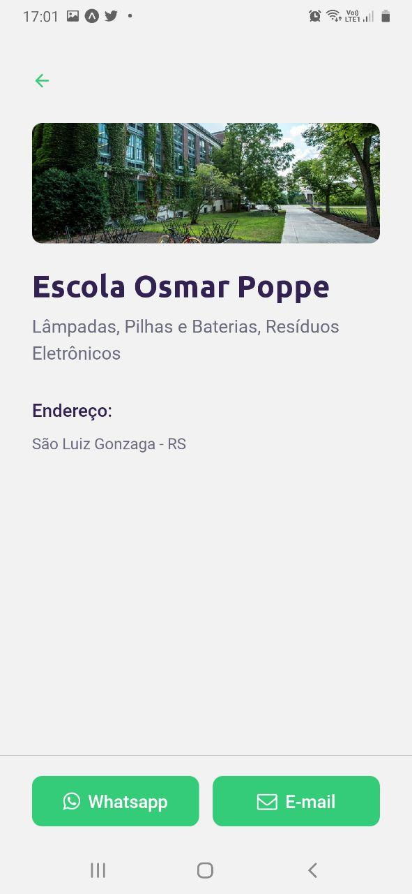
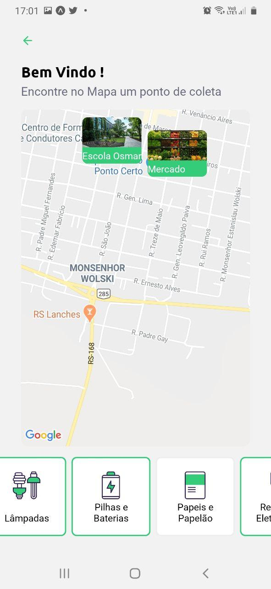
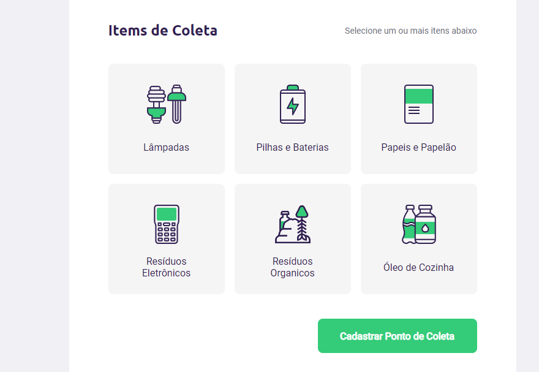

<h1 align="center">
    

</h1>

Este é um projeto desenvolvido para implementar um localizador de pontos de coletas de lixo como resíduos organicos, lampadas entre outros. 

  

  

   

---

## Sumario

<ul>
  <li><a href="#-ponto-de-partida">Ponto de Partida</a></li>
  <li><a href="#-funcionalidades-do-aplicativo">Funcionaldiades do Aplicativo</a></li>
  <li><a href="#-funcionalidades-do-aplicativo">Tecnologias</a></li>
  <li><a href="#-Screenshots">Screenshots</a></li>
</ul>

---

## 🚀 Ponto de Partida
Para rodar este aplicativo instale todas a suas dependências em cada pasta do projeto (web, sever, mobile) com o comando npm install.
Execute o comando "npm run seed" para adicionar a lista de items pré cadastrada
Após basta rodar o comando "npm start" em cada pasta

## 📋 Funcionalidades do Aplicativo
Estas são as funcionalidades da aplicação em cada um dos ambientes (Web, Mobile)

### Aplicação Web
 - [x] Criação de pontos de coleta 
 - [x] Upload de imagem do ponto de coleta
 - [x] Seleção dos items coletáveis por este ponto
 
### Aplicação Mobile
 - [x] Listar pontos de coleta no mapa por cidade, uf e items coletaveis por aquele ponto
 - [x] Acessar os dados do ponto de coleta clicando no icone do mapa
 - [x] Entrar em contato por e-mail ou whatsapp

### Tecnologias
Foi utilizado para construção desta aplicação o react, react-native, node.js, Banco de Dados Postgre e bibliotecas de mapas leaflet e google maps 

---
## Screenshots
---

 
